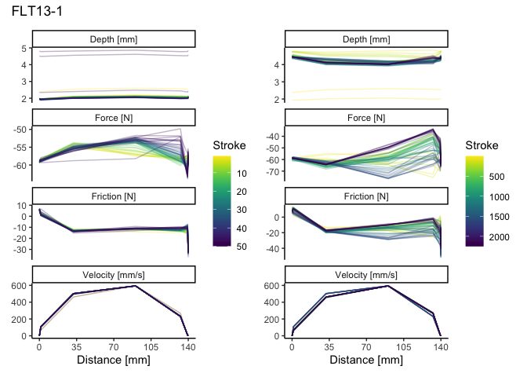
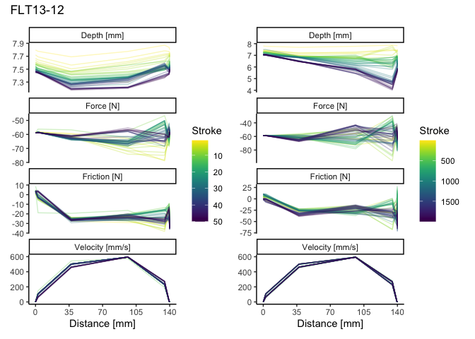
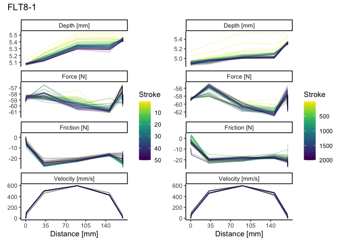
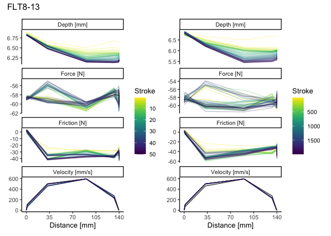

Data Analysis SMARTTESTER®
================
Hannah Rausch (adapted from Ivan Calandra & Lisa Schunk)
2023-07-28 12:52:53 CEST

- [Goal of the script](#goal-of-the-script)
- [Load packages](#load-packages)
- [Get name, path and information of the
  file](#get-name-path-and-information-of-the-file)
- [Load data into R object](#load-data-into-r-object)
- [Plot each of the selected numeric
  variable](#plot-each-of-the-selected-numeric-variable)
  - [Plots showing the strokes as
    lines](#plots-showing-the-strokes-as-lines)
- [Descriptive statistics](#descriptive-statistics)
  - [Create function to compute the statistics at
    once](#create-function-to-compute-the-statistics-at-once)
  - [Summary statistics](#summary-statistics)
  - [Export statistics](#export-statistics)
- [sessionInfo()](#sessioninfo)
- [Cite R packages used](#cite-r-packages-used)
  - [References](#references)

------------------------------------------------------------------------

# Goal of the script

Data analysis of SMARTTESTER sensor data

``` r
dir_in <- "a_raw_data_smarttester"
dir_out <- "d_output_data_smarttester"
```

Raw data must be located in ~/a_raw_data_smarttester.  
Formatted data will be saved in ~/d_output_data_smarttester. The knit
directory for this script is the project directory.

------------------------------------------------------------------------

# Load packages

``` r
pack_to_load <- c("tidyverse", "R.utils", "openxlsx", "tools", "patchwork", "doBy", "ggrepel", "ggplot2", "grateful", "viridis")
sapply(pack_to_load, library, character.only = TRUE, logical.return = TRUE) 
```

    tidyverse   R.utils  openxlsx     tools patchwork      doBy   ggrepel   ggplot2 
         TRUE      TRUE      TRUE      TRUE      TRUE      TRUE      TRUE      TRUE 
     grateful   viridis 
         TRUE      TRUE 

------------------------------------------------------------------------

# Get name, path and information of the file

``` r
data_file <- list.files(dir_in, pattern = "\\.xlsx$", full.names = TRUE)
data_file
```

    [1] "a_raw_data_smarttester/b_data_smarttester_stepmm.xlsx"

# Load data into R object

``` r
imp_data <- read.xlsx(data_file)
str(imp_data)
```

    'data.frame':   82466 obs. of  12 variables:
     $ Sample      : chr  "FLT8-1" "FLT8-1" "FLT8-1" "FLT8-1" ...
     $ Angle       : chr  "45°" "45°" "45°" "45°" ...
     $ Task        : chr  "cutting" "cutting" "cutting" "cutting" ...
     $ Raw_material: chr  "Flint" "Flint" "Flint" "Flint" ...
     $ Stroke      : num  1 1 1 1 1 1 1 1 1 1 ...
     $ Step        : num  1 2 3 4 5 6 7 8 9 10 ...
     $ Relative_pos: num  0 1.35 32.02 90.39 146.31 ...
     $ Force       : num  -58.8 -58.5 -57.3 -59.4 -58.8 ...
     $ Friction    : num  0.819 0.302 -22.08 -19.881 -15.87 ...
     $ Depth       : num  5.13 5.14 5.3 5.53 5.53 ...
     $ Position    : num  153 154 185 243 299 ...
     $ Velocity    : num  2.84e-03 6.78e+01 4.61e+02 5.95e+02 4.65e+02 ...

The imported file is:
“~/a_raw_data_smarttester/b_data_smarttester_stepmm.xlsx”

------------------------------------------------------------------------

# Plot each of the selected numeric variable

## Plots showing the strokes as lines

``` r
# split the data in the individual 4 samples
sp <- split(imp_data, imp_data[["Sample"]])
str(sp)
```

    List of 4
     $ FLT13-1 :'data.frame':   22490 obs. of  12 variables:
      ..$ Sample      : chr [1:22490] "FLT13-1" "FLT13-1" "FLT13-1" "FLT13-1" ...
      ..$ Angle       : chr [1:22490] NA NA NA NA ...
      ..$ Task        : chr [1:22490] "cutting" "cutting" "cutting" "cutting" ...
      ..$ Raw_material: chr [1:22490] "Flint" "Flint" "Flint" "Flint" ...
      ..$ Stroke      : num [1:22490] 1 1 1 1 1 1 1 1 1 1 ...
      ..$ Step        : num [1:22490] 1 2 3 4 5 6 7 8 9 10 ...
      ..$ Relative_pos: num [1:22490] 0 1.3 32 90.4 132.6 ...
      ..$ Force       : num [1:22490] -59.3 -58.3 -54.8 -57.2 -58.2 ...
      ..$ Friction    : num [1:22490] 2.85 3.15 -13.24 -14.27 -14.79 ...
      ..$ Depth       : num [1:22490] 2.39 2.39 2.54 2.6 2.56 ...
      ..$ Position    : num [1:22490] 170 171 202 260 303 ...
      ..$ Velocity    : num [1:22490] 2.63e-03 6.61e+01 4.62e+02 5.95e+02 2.68e+02 ...
     $ FLT13-12:'data.frame':   19990 obs. of  12 variables:
      ..$ Sample      : chr [1:19990] "FLT13-12" "FLT13-12" "FLT13-12" "FLT13-12" ...
      ..$ Angle       : chr [1:19990] NA NA NA NA ...
      ..$ Task        : chr [1:19990] "cutting" "cutting" "cutting" "cutting" ...
      ..$ Raw_material: chr [1:19990] "Flint" "Flint" "Flint" "Flint" ...
      ..$ Stroke      : num [1:19990] 1 1 1 1 1 1 1 1 1 1 ...
      ..$ Step        : num [1:19990] 1 2 3 4 5 6 7 8 9 10 ...
      ..$ Relative_pos: num [1:19990] 0 2.6 37.3 96.3 134.7 ...
      ..$ Force       : num [1:19990] -58.5 -58.3 -59.3 -63 -66.6 ...
      ..$ Friction    : num [1:19990] 4.96 -2.98 -27.6 -29.11 -29.15 ...
      ..$ Depth       : num [1:19990] 7.8 7.78 7.69 7.77 7.87 ...
      ..$ Position    : num [1:19990] 170 173 207 266 305 ...
      ..$ Velocity    : num [1:19990] 8.26e-04 1.07e+02 5.03e+02 5.94e+02 2.30e+02 ...
     $ FLT8-1  :'data.frame':   19996 obs. of  12 variables:
      ..$ Sample      : chr [1:19996] "FLT8-1" "FLT8-1" "FLT8-1" "FLT8-1" ...
      ..$ Angle       : chr [1:19996] "45°" "45°" "45°" "45°" ...
      ..$ Task        : chr [1:19996] "cutting" "cutting" "cutting" "cutting" ...
      ..$ Raw_material: chr [1:19996] "Flint" "Flint" "Flint" "Flint" ...
      ..$ Stroke      : num [1:19996] 1 1 1 1 1 1 1 1 1 1 ...
      ..$ Step        : num [1:19996] 1 2 3 4 5 6 7 8 9 10 ...
      ..$ Relative_pos: num [1:19996] 0 1.35 32.02 90.39 146.31 ...
      ..$ Force       : num [1:19996] -58.8 -58.5 -57.3 -59.4 -58.8 ...
      ..$ Friction    : num [1:19996] 0.819 0.302 -22.08 -19.881 -15.87 ...
      ..$ Depth       : num [1:19996] 5.13 5.14 5.3 5.53 5.53 ...
      ..$ Position    : num [1:19996] 153 154 185 243 299 ...
      ..$ Velocity    : num [1:19996] 2.84e-03 6.78e+01 4.61e+02 5.95e+02 4.65e+02 ...
     $ FLT8-13 :'data.frame':   19990 obs. of  12 variables:
      ..$ Sample      : chr [1:19990] "FLT8-13" "FLT8-13" "FLT8-13" "FLT8-13" ...
      ..$ Angle       : chr [1:19990] "45°" "45°" "45°" "45°" ...
      ..$ Task        : chr [1:19990] "cutting" "cutting" "cutting" "cutting" ...
      ..$ Raw_material: chr [1:19990] "Flint" "Flint" "Flint" "Flint" ...
      ..$ Stroke      : num [1:19990] 1 1 1 1 1 1 1 1 1 1 ...
      ..$ Step        : num [1:19990] 1 2 3 4 5 6 7 8 9 10 ...
      ..$ Relative_pos: num [1:19990] 0 1.33 32.01 90.4 132.62 ...
      ..$ Force       : num [1:19990] -59.1 -58.9 -58.4 -61 -57.7 ...
      ..$ Friction    : num [1:19990] -3.49 -3.58 -23.5 -28.76 -27.73 ...
      ..$ Depth       : num [1:19990] 6.89 6.89 6.65 6.5 6.67 ...
      ..$ Position    : num [1:19990] 170 171 202 260 303 ...
      ..$ Velocity    : num [1:19990] 8.05e-04 6.70e+01 4.62e+02 5.95e+02 2.69e+02 ...

``` r
# select parameters to plot
y_var <- c("Force", "Friction", "Depth", "Velocity")

# Plot every 40th stroke
for (i in seq_along(sp)) {
  # create a sequence of every 40th stroke, always including the first and the last strokes
   seq_st <- seq(1, length(unique(sp[[i]][["Stroke"]])), by = 40) %>% 
    c(max(unique(sp[[i]][["Stroke"]])))
  
  #
  dat_i_40th <- filter(sp[[i]], Stroke %in% seq_st)
  dat_i_50 <- filter(sp[[i]], Stroke %in% 1:50)
  
  # Pivot to longer format for facet plots
  data_long_40th <- select(dat_i_40th, all_of(c("Relative_pos", y_var, "Stroke"))) %>%
             pivot_longer(all_of(y_var), names_to = "parameter", values_to = "value")
  str(data_long_40th)
  data_long_50 <- select(dat_i_50, all_of(c("Relative_pos", y_var, "Stroke"))) %>%
             pivot_longer(all_of(y_var), names_to = "parameter", values_to = "value") 
  str(data_long_50)
  
  # Axes labels with units
  param.labs <- c("Force [N]", "Friction [N]", "Depth [mm]", "Velocity [mm/s]")
  names(param.labs) <- y_var
    
  # Plot
  p1 <- ggplot(data = data_long_40th, aes(x = Relative_pos, y = value, color = Stroke)) +
    geom_line(aes(group = Stroke), alpha = 0.3) + 
    # Wrap around parameters with free y-scales
    facet_wrap(~ parameter, scales = "free_y", ncol = 1, labeller = labeller(parameter = param.labs)) +
    
    labs(x = "Distance [mm]", y = NULL) +
    # reverse the legend starting with 0 going to 2000 strokes    
    scale_color_viridis(trans = "reverse") + 
    # change the 'Step-number' in the x-legend  
    scale_x_continuous(breaks=c(0, 35, 70, 105, 140)) +
    theme_classic()
  
  # plot only the first 50 strokes per sample  
  p2 <- ggplot(data = data_long_50, aes(x = Relative_pos, y = value, color = Stroke)) +
    geom_line(aes(group = Stroke), alpha = 0.3) + 
    # Wrap around parameters with free y-scales
    facet_wrap(~ parameter, scales = "free_y", ncol = 1, labeller = labeller(parameter = param.labs)) +
    
    labs(x = "Distance [mm]", y = NULL) +
    # reverse the legend starting with 0 going to 2000 strokes    
    scale_color_viridis(trans = "reverse") + 
    # change the 'Step-number' in the x-legend  
    scale_x_continuous(breaks=c(0, 35, 70, 105, 140)) +
    theme_classic()

  # patchwork plot
  p <- p2 + p1 + plot_annotation(title = names(sp)[i]) 
  print(p)
  # save to PDF
  file_out <- paste0(file_path_sans_ext(basename(data_file)), "_plot_", names(sp)[i], ".pdf") %>%
    gsub("b_", "d_", .)
  ggsave(filename = file_out, plot = p, path = dir_out, device = "pdf")
} 
```

    tibble [2,320 × 4] (S3: tbl_df/tbl/data.frame)
     $ Relative_pos: num [1:2320] 0 0 0 0 1.3 1.3 1.3 1.3 32 32 ...
     $ Stroke      : num [1:2320] 1 1 1 1 1 1 1 1 1 1 ...
     $ parameter   : chr [1:2320] "Force" "Friction" "Depth" "Velocity" ...
     $ value       : num [1:2320] -59.25393 2.84626 2.38921 0.00263 -58.34831 ...
    tibble [2,000 × 4] (S3: tbl_df/tbl/data.frame)
     $ Relative_pos: num [1:2000] 0 0 0 0 1.3 1.3 1.3 1.3 32 32 ...
     $ Stroke      : num [1:2000] 1 1 1 1 1 1 1 1 1 1 ...
     $ parameter   : chr [1:2000] "Force" "Friction" "Depth" "Velocity" ...
     $ value       : num [1:2000] -59.25393 2.84626 2.38921 0.00263 -58.34831 ...

    Warning: Removed 50 rows containing missing values (`geom_line()`).

    Warning: Removed 49 rows containing missing values (`geom_line()`).

    Warning: Removed 50 rows containing missing values (`geom_line()`).

    Warning: Removed 49 rows containing missing values (`geom_line()`).

<!-- -->

    tibble [2,040 × 4] (S3: tbl_df/tbl/data.frame)
     $ Relative_pos: num [1:2040] 0 0 0 0 2.6 ...
     $ Stroke      : num [1:2040] 1 1 1 1 1 1 1 1 1 1 ...
     $ parameter   : chr [1:2040] "Force" "Friction" "Depth" "Velocity" ...
     $ value       : num [1:2040] -5.85e+01 4.96 7.80 8.26e-04 -5.83e+01 ...
    tibble [2,000 × 4] (S3: tbl_df/tbl/data.frame)
     $ Relative_pos: num [1:2000] 0 0 0 0 2.6 ...
     $ Stroke      : num [1:2000] 1 1 1 1 1 1 1 1 1 1 ...
     $ parameter   : chr [1:2000] "Force" "Friction" "Depth" "Velocity" ...
     $ value       : num [1:2000] -5.85e+01 4.96 7.80 8.26e-04 -5.83e+01 ...

    Warning: Removed 50 rows containing missing values (`geom_line()`).

    Warning: Removed 38 rows containing missing values (`geom_line()`).

    Warning: Removed 50 rows containing missing values (`geom_line()`).

    Warning: Removed 38 rows containing missing values (`geom_line()`).

<!-- -->

    tibble [2,040 × 4] (S3: tbl_df/tbl/data.frame)
     $ Relative_pos: num [1:2040] 0 0 0 0 1.35 ...
     $ Stroke      : num [1:2040] 1 1 1 1 1 1 1 1 1 1 ...
     $ parameter   : chr [1:2040] "Force" "Friction" "Depth" "Velocity" ...
     $ value       : num [1:2040] -58.82268 0.81938 5.1318 0.00284 -58.47768 ...
    tibble [2,000 × 4] (S3: tbl_df/tbl/data.frame)
     $ Relative_pos: num [1:2000] 0 0 0 0 1.35 ...
     $ Stroke      : num [1:2000] 1 1 1 1 1 1 1 1 1 1 ...
     $ parameter   : chr [1:2000] "Force" "Friction" "Depth" "Velocity" ...
     $ value       : num [1:2000] -58.82268 0.81938 5.1318 0.00284 -58.47768 ...

<!-- -->

    tibble [2,040 × 4] (S3: tbl_df/tbl/data.frame)
     $ Relative_pos: num [1:2040] 0 0 0 0 1.33 ...
     $ Stroke      : num [1:2040] 1 1 1 1 1 1 1 1 1 1 ...
     $ parameter   : chr [1:2040] "Force" "Friction" "Depth" "Velocity" ...
     $ value       : num [1:2040] -5.91e+01 -3.49 6.89 8.05e-04 -5.89e+01 ...
    tibble [2,000 × 4] (S3: tbl_df/tbl/data.frame)
     $ Relative_pos: num [1:2000] 0 0 0 0 1.33 ...
     $ Stroke      : num [1:2000] 1 1 1 1 1 1 1 1 1 1 ...
     $ parameter   : chr [1:2000] "Force" "Friction" "Depth" "Velocity" ...
     $ value       : num [1:2000] -5.91e+01 -3.49 6.89 8.05e-04 -5.89e+01 ...

    Warning: Removed 43 rows containing missing values (`geom_line()`).

    Warning: Removed 34 rows containing missing values (`geom_line()`).

    Warning: Removed 43 rows containing missing values (`geom_line()`).

    Warning: Removed 34 rows containing missing values (`geom_line()`).

<!-- -->

------------------------------------------------------------------------

# Descriptive statistics

## Create function to compute the statistics at once

``` r
NMinMaxMeanMedSd <- function(x){
  y <- x[!is.na(x)]     # Exclude NAs
  n_test <- length(y)   # Sample size (n)
  min_test <- min(y)    # Minimum
  max_test <- max(y)    # Maximum
  mean_test <- mean(y)  # Mean
  med_test <- median(y) # Median
  sd_test <- sd(y)      # Standard deviation
  out <- c(n_test, min_test, max_test, mean_test, med_test, sd_test) # Concatenate
  names(out) <- c("n", "min", "max", "mean", "median", "sd")         # Name values
  return(out)                                                        # Object to return
}
N.distinct <- function(x){
  y <- x[!is.na(x)]     # Exclude NAs
  n_test <- length(y)   # Sample size (n)
  unique_test <- length(unique(y)) # Number of unique values
  out <- c(n_test, unique_test) # Concatenate
  names(out) <- c("n", "distinct")         # Name values
  return(out)                                                        # Object to return
}
```

## Summary statistics

``` r
all_stats <- summaryBy(.~ Sample, data = imp_data[c(y_var, "Sample")], FUN = NMinMaxMeanMedSd)
all_stats
```

        Sample Force.n  Force.min Force.max Force.mean Force.median Force.sd
    1  FLT13-1   20560  -80.16962 -32.64572  -57.98501    -58.90893 6.861250
    2 FLT13-12   18581 -100.30906 -29.28196  -59.44206    -58.90893 7.764024
    3   FLT8-1   19996  -63.69582 -53.99267  -59.16159    -58.99518 1.733389
    4  FLT8-13   18592  -63.35082 -52.87141  -58.79396    -58.77956 1.180567
      Friction.n Friction.min Friction.max Friction.mean Friction.median
    1      20558    -53.08704    13.929419     -16.04226       -17.25005
    2      18544    -78.09962    28.635090     -24.28087       -26.69446
    3      19975    -28.20384     6.253144     -17.16303       -19.75131
    4      18562    -62.31582     5.865018     -30.49428       -34.06885
      Friction.sd Depth.n Depth.min Depth.max Depth.mean Depth.median  Depth.sd
    1   17.270818   20560  1.877563  4.897489   4.324279     4.406588 0.3812218
    2   20.788969   18581  3.973304  7.926634   6.485091     6.685937 0.7242687
    3    7.832471   19996  4.847554  5.534355   5.151890     5.286983 0.1768574
    4   17.614772   18591  5.429107  6.910261   6.096649     5.990685 0.4338833
      Velocity.n Velocity.min Velocity.max Velocity.mean Velocity.median
    1      20560  -0.02315011     596.2136      154.5597        7.638722
    2      18581  -0.15909275     597.9070      152.5620        6.339116
    3      19996  -0.02649481     597.0498      166.7558       14.526134
    4      18591  -0.01257604     595.6479      154.3849        6.316432
      Velocity.sd
    1    217.2810
    2    216.8780
    3    227.3009
    4    218.1538

``` r
stroke_stats <- summaryBy(.~ Sample, data = imp_data[c("Stroke", "Sample")], FUN = N.distinct)
stroke_stats
```

        Sample Stroke.n Stroke.distinct
    1  FLT13-1    22490            2249
    2 FLT13-12    19990            1999
    3   FLT8-1    19996            2000
    4  FLT8-13    19990            1999

## Export statistics

``` r
write.xlsx(list(Stroke = stroke_stats, Parameters = all_stats), 
           file = paste0(dir_out, "/d_descriptivestats_smarttester_stepmm.xlsx"))
```

------------------------------------------------------------------------

# sessionInfo()

``` r
sessionInfo()
```

    R version 4.2.2 (2022-10-31)
    Platform: x86_64-apple-darwin17.0 (64-bit)
    Running under: macOS Big Sur ... 10.16

    Matrix products: default
    BLAS:   /Library/Frameworks/R.framework/Versions/4.2/Resources/lib/libRblas.0.dylib
    LAPACK: /Library/Frameworks/R.framework/Versions/4.2/Resources/lib/libRlapack.dylib

    locale:
    [1] en_US.UTF-8/en_US.UTF-8/en_US.UTF-8/C/en_US.UTF-8/en_US.UTF-8

    attached base packages:
    [1] tools     stats     graphics  grDevices utils     datasets  methods  
    [8] base     

    other attached packages:
     [1] viridis_0.6.2     viridisLite_0.4.1 grateful_0.2.0    ggrepel_0.9.2    
     [5] doBy_4.6.16       patchwork_1.1.2   openxlsx_4.2.5.1  R.utils_2.12.2   
     [9] R.oo_1.25.0       R.methodsS3_1.8.2 forcats_0.5.2     stringr_1.5.0    
    [13] dplyr_1.0.10      purrr_1.0.1       readr_2.1.3       tidyr_1.2.1      
    [17] tibble_3.1.8      ggplot2_3.4.0     tidyverse_1.3.2  

    loaded via a namespace (and not attached):
     [1] httr_1.4.4           sass_0.4.4           jsonlite_1.8.4      
     [4] modelr_0.1.10        bslib_0.4.1          microbenchmark_1.4.9
     [7] assertthat_0.2.1     highr_0.9            googlesheets4_1.0.1 
    [10] cellranger_1.1.0     yaml_2.3.6           pillar_1.8.1        
    [13] backports_1.4.1      lattice_0.20-45      glue_1.6.2          
    [16] digest_0.6.30        rvest_1.0.3          colorspace_2.0-3    
    [19] htmltools_0.5.4      Matrix_1.5-1         pkgconfig_2.0.3     
    [22] broom_1.0.1          haven_2.5.1          scales_1.2.1        
    [25] tzdb_0.3.0           timechange_0.2.0     googledrive_2.0.0   
    [28] farver_2.1.1         generics_0.1.3       ellipsis_0.3.2      
    [31] cachem_1.0.6         withr_2.5.0          cli_3.4.1           
    [34] magrittr_2.0.3       crayon_1.5.2         readxl_1.4.1        
    [37] evaluate_0.18        fs_1.5.2             fansi_1.0.3         
    [40] MASS_7.3-58.1        xml2_1.3.3           hms_1.1.2           
    [43] gargle_1.3.0         lifecycle_1.0.3      munsell_0.5.0       
    [46] reprex_2.0.2         zip_2.2.2            compiler_4.2.2      
    [49] Deriv_4.1.3          jquerylib_0.1.4      rlang_1.0.6         
    [52] grid_4.2.2           rstudioapi_0.14      labeling_0.4.2      
    [55] rmarkdown_2.20       gtable_0.3.1         DBI_1.1.3           
    [58] R6_2.5.1             gridExtra_2.3        lubridate_1.9.1     
    [61] knitr_1.41           fastmap_1.1.0        utf8_1.2.2          
    [64] rprojroot_2.0.3      stringi_1.7.8        Rcpp_1.0.9          
    [67] vctrs_0.5.1          dbplyr_2.3.0         tidyselect_1.2.0    
    [70] xfun_0.39           

------------------------------------------------------------------------

# Cite R packages used

We used the following R packages: doBy v. 4.6.16 (Højsgaard and Halekoh
2023), ggrepel v. 0.9.2 (Slowikowski 2022), grateful v. 0.2.0 (Francisco
Rodríguez-Sánchez, Connor P. Jackson, and Shaurita D. Hutchins 2023),
openxlsx v. 4.2.5.1 (Schauberger and Walker 2022), patchwork v. 1.1.2
(Pedersen 2022), R.utils v. 2.12.2 (Bengtsson 2022), tidyverse v. 1.3.2
(Wickham et al. 2019), tools v. 4.2.2 (R Core Team 2022), viridis v.
0.6.2 (Garnier et al. 2021), running in RStudio v. 2023.6.0.421 (Posit
team 2023).

## References

<div id="refs" class="references csl-bib-body hanging-indent">

<div id="ref-Rutils" class="csl-entry">

Bengtsson, Henrik. 2022. *<span class="nocase">R.utils</span>: Various
Programming Utilities*. <https://CRAN.R-project.org/package=R.utils>.

</div>

<div id="ref-grateful" class="csl-entry">

Francisco Rodríguez-Sánchez, Connor P. Jackson, and Shaurita D.
Hutchins. 2023. *<span class="nocase">grateful</span>: Facilitate
Citation of r Packages*. <https://github.com/Pakillo/grateful>.

</div>

<div id="ref-viridis" class="csl-entry">

Garnier, Simon, Ross, Noam, Rudis, Robert, Camargo, et al. 2021.
*<span class="nocase">viridis</span> - Colorblind-Friendly Color Maps
for r*. <https://doi.org/10.5281/zenodo.4679424>.

</div>

<div id="ref-doBy" class="csl-entry">

Højsgaard, Søren, and Ulrich Halekoh. 2023.
*<span class="nocase">doBy</span>: Groupwise Statistics, LSmeans, Linear
Estimates, Utilities*. <https://CRAN.R-project.org/package=doBy>.

</div>

<div id="ref-patchwork" class="csl-entry">

Pedersen, Thomas Lin. 2022. *<span class="nocase">patchwork</span>: The
Composer of Plots*. <https://CRAN.R-project.org/package=patchwork>.

</div>

<div id="ref-rstudio" class="csl-entry">

Posit team. 2023. *RStudio: Integrated Development Environment for r*.
Boston, MA: Posit Software, PBC. <http://www.posit.co/>.

</div>

<div id="ref-tools" class="csl-entry">

R Core Team. 2022. *R: A Language and Environment for Statistical
Computing*. Vienna, Austria: R Foundation for Statistical Computing.
<https://www.R-project.org/>.

</div>

<div id="ref-openxlsx" class="csl-entry">

Schauberger, Philipp, and Alexander Walker. 2022.
*<span class="nocase">openxlsx</span>: Read, Write and Edit Xlsx Files*.
<https://CRAN.R-project.org/package=openxlsx>.

</div>

<div id="ref-ggrepel" class="csl-entry">

Slowikowski, Kamil. 2022. *<span class="nocase">ggrepel</span>:
Automatically Position Non-Overlapping Text Labels with
“<span class="nocase">ggplot2</span>”*.
<https://CRAN.R-project.org/package=ggrepel>.

</div>

<div id="ref-tidyverse" class="csl-entry">

Wickham, Hadley, Mara Averick, Jennifer Bryan, Winston Chang, Lucy
D’Agostino McGowan, Romain François, Garrett Grolemund, et al. 2019.
“Welcome to the <span class="nocase">tidyverse</span>.” *Journal of Open
Source Software* 4 (43): 1686. <https://doi.org/10.21105/joss.01686>.

</div>

</div>
