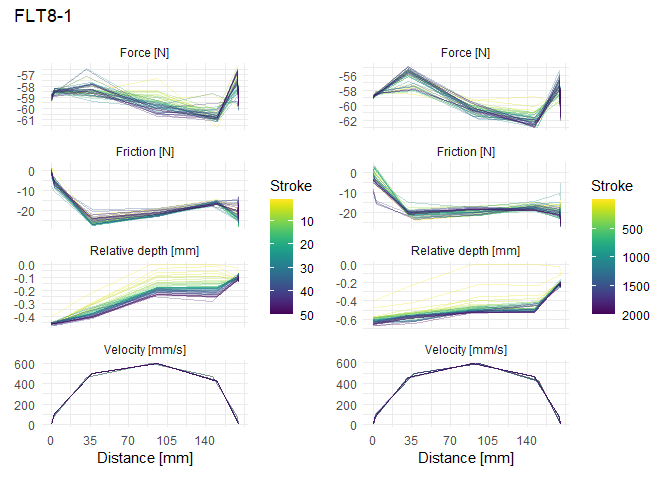

Data Analysis SMARTTESTER®
================
Hannah Rausch (adapted from Ivan Calandra & Lisa Schunk)
2023-10-13 14:28:11 CEST

- [Goal of the script](#goal-of-the-script)
- [Load packages](#load-packages)
- [Get name, path and information of the
  file](#get-name-path-and-information-of-the-file)
- [Load data into R object](#load-data-into-r-object)
- [Calculate new parameters](#calculate-new-parameters)
  - [Relative depth](#relative-depth)
  - [Relative position](#relative-position)
  - [Check results](#check-results)
- [Plot the sensor data of each parameter with strokes as line
  graphs](#plot-the-sensor-data-of-each-parameter-with-strokes-as-line-graphs)
- [Plot the sensor data of each parameter with strokes as line
  graphs](#plot-the-sensor-data-of-each-parameter-with-strokes-as-line-graphs-1)
- [Descriptive statistics](#descriptive-statistics)
  - [Create functions to compute the statistics in
    bulk](#create-functions-to-compute-the-statistics-in-bulk)
  - [Summary statistics](#summary-statistics)
  - [Export statistics](#export-statistics)
- [sessionInfo()](#sessioninfo)
- [Cite R packages used](#cite-r-packages-used)
  - [References](#references)

------------------------------------------------------------------------

# Goal of the script

Analysis of the SMARTTESTER sensor data containing the parameters depth,
force, friction and velocity. This is achieved by creating line graphs
displaying the data of each parameter for each of the four samples.
Additionally, descriptive statistics of each parameter for each sample
is retrieved. A bibliography of the R packages used is found at the end
of the script.

``` r
dir_in <- "a_raw_data_smarttester"
dir_out <- "b_output_data_smarttester"
```

Raw data must be located in ~/a_raw_data_smarttester.  
Formatted data will be saved in ~/b_output_data_smarttester. The knit
directory for this script is the project directory.

------------------------------------------------------------------------

# Load packages

``` r
pack_to_load <- c("tidyverse", "R.utils", "openxlsx", "tools", "patchwork", "doBy", "ggplot2", "grateful", "viridis")
sapply(pack_to_load, library, character.only = TRUE, logical.return = TRUE) 
```

    tidyverse   R.utils  openxlsx     tools patchwork      doBy   ggplot2  grateful 
         TRUE      TRUE      TRUE      TRUE      TRUE      TRUE      TRUE      TRUE 
      viridis 
         TRUE 

------------------------------------------------------------------------

# Get name, path and information of the file

``` r
data_file <- list.files(dir_in, pattern = "\\.xlsx$", full.names = TRUE)
data_file
```

    [1] "a_raw_data_smarttester/data_smarttester_stepmm.xlsx"

# Load data into R object

``` r
imp_data <- read.xlsx(data_file)
str(imp_data)
```

    'data.frame':   82466 obs. of  11 variables:
     $ Sample      : chr  "FLT8-1" "FLT8-1" "FLT8-1" "FLT8-1" ...
     $ Angle       : chr  "45°" "45°" "45°" "45°" ...
     $ Task        : chr  "cutting" "cutting" "cutting" "cutting" ...
     $ Raw_material: chr  "Flint" "Flint" "Flint" "Flint" ...
     $ Stroke      : num  1 1 1 1 1 1 1 1 1 1 ...
     $ Step        : num  1 2 3 4 5 6 7 8 9 10 ...
     $ Force       : num  -58.8 -58.5 -57.3 -59.4 -58.8 ...
     $ Friction    : num  0.819 0.302 -22.08 -19.881 -15.87 ...
     $ Depth       : num  5.13 5.14 5.3 5.53 5.53 ...
     $ Position    : num  153 154 185 243 299 ...
     $ Velocity    : num  2.84e-03 6.78e+01 4.61e+02 5.95e+02 4.65e+02 ...

The imported file is:
“~/a_raw_data_smarttester/data_smarttester_stepmm.xlsx”

------------------------------------------------------------------------

# Calculate new parameters

## Relative depth

The lower the recorded value for `Depth`, the deeper the tool has
penetrated into the contact material. This scale is not intuitive on a
plot, so we decided to calculate the relative depth.

For `Sample` s, the relative depth at `Stroke` i & `Step` j is then
defined as the `Depth` at `Stroke` i and `Step` j minus the maximum
depth across all strokes:  
$Rel.Depth_{s,i,j} = Depth_{s,i,j} - Max.depth_s$

``` r
imp_data <- imp_data %>% 
            group_by(Sample) %>% 
            mutate(Rel.Depth = Depth - max(Depth, na.rm = TRUE))
```

With this calculation, the scale of the `Rel.Depth` parameter is in a
more intuitive way on a plot: lower (negative) values indicate deeper
penetration.

``` r
head(select(imp_data, Sample, Stroke, Step, Depth, Rel.Depth), n = 10L)
```

    # A tibble: 10 × 5
    # Groups:   Sample [1]
       Sample Stroke  Step Depth Rel.Depth
       <chr>   <dbl> <dbl> <dbl>     <dbl>
     1 FLT8-1      1     1  5.13  -0.403  
     2 FLT8-1      1     2  5.14  -0.395  
     3 FLT8-1      1     3  5.30  -0.237  
     4 FLT8-1      1     4  5.53  -0.00307
     5 FLT8-1      1     5  5.53   0      
     6 FLT8-1      1     6  5.51  -0.0238 
     7 FLT8-1      1     7  5.46  -0.0699 
     8 FLT8-1      1     8  5.47  -0.0668 
     9 FLT8-1      1     9  5.48  -0.0522 
    10 FLT8-1      1    10  5.46  -0.0722 

While the maximum depth should theoretically be at the beginning of the
experiment (Stroke 1 & Step 1) for each sample, it is not the case. This
is why we chose the maximum recorded `Depth` per sample ($Max.depth_s$
), rather than the first `Depth` measurement, as the reference for the
relative depth on each sample.  
The maximum depth for each sample has been recorded at these strokes and
steps:

``` r
imp_data %>% group_by(Sample) %>% slice_max(Depth)
```

    # A tibble: 4 × 12
    # Groups:   Sample [4]
      Sample   Angle Task    Raw_material Stroke  Step Force Friction Depth Position
      <chr>    <chr> <chr>   <chr>         <dbl> <dbl> <dbl>    <dbl> <dbl>    <dbl>
    1 FLT13-1  <NA>  cutting Flint            64     5 -61.8   -18.1   4.90     302.
    2 FLT13-12 <NA>  cutting Flint           174     5 -33.6    -8.41  7.93     302.
    3 FLT8-1   45°   cutting Flint             1     5 -58.8   -15.9   5.53     299.
    4 FLT8-13  45°   cutting Flint             2     1 -58.9     2.50  6.91     170.
    # ℹ 2 more variables: Velocity <dbl>, Rel.Depth <dbl>

## Relative position

The `Position` value along the X axis is recorded across each stroke at
10 Hz (i.e. 10 readings per second). Due to inaccuracies, the absolute X
position at each `Step` might slightly differ from one stroke to
another. Additionally, the starting position is not 0. We therefore
calculate here the relative position.

For `Sample` s and `Stroke` i, the relative position at `Step` j is then
defined as the `Position` at `Step` j minus the `Position` at `Step`
1:  
$Rel.Position_{s,i,j} = Position_{s,i,j} - Position_{s,i,1}$

``` r
imp_data <- imp_data %>% 
            group_by(Sample, Stroke) %>% 
            mutate(Rel.Position = Position - Position[1])
head(select(imp_data, Sample, Stroke, Step, Position, Rel.Position), n = 10L)
```

    # A tibble: 10 × 5
    # Groups:   Sample, Stroke [1]
       Sample Stroke  Step Position Rel.Position
       <chr>   <dbl> <dbl>    <dbl>        <dbl>
     1 FLT8-1      1     1     153.         0   
     2 FLT8-1      1     2     154.         1.35
     3 FLT8-1      1     3     185.        32.0 
     4 FLT8-1      1     4     243.        90.4 
     5 FLT8-1      1     5     299.       146.  
     6 FLT8-1      1     6     322.       169.  
     7 FLT8-1      1     7     323.       170.  
     8 FLT8-1      1     8     323.       170.  
     9 FLT8-1      1     9     323.       170.  
    10 FLT8-1      1    10     323.       170.  

## Check results

``` r
imp_data <- as.data.frame(imp_data)
head(imp_data, n = 10L)
```

       Sample Angle    Task Raw_material Stroke Step     Force    Friction    Depth
    1  FLT8-1   45° cutting        Flint      1    1 -58.82268   0.8193775 5.131800
    2  FLT8-1   45° cutting        Flint      1    2 -58.47768   0.3018760 5.139482
    3  FLT8-1   45° cutting        Flint      1    3 -57.27018 -22.0800690 5.296970
    4  FLT8-1   45° cutting        Flint      1    4 -59.38331 -19.8806860 5.531282
    5  FLT8-1   45° cutting        Flint      1    5 -58.77956 -15.8700490 5.534355
    6  FLT8-1   45° cutting        Flint      1    6 -59.72831 -16.7756770 5.510540
    7  FLT8-1   45° cutting        Flint      1    7 -59.98706 -18.4144330 5.464445
    8  FLT8-1   45° cutting        Flint      1    8 -58.30518 -24.9694520 5.467518
    9  FLT8-1   45° cutting        Flint      1    9 -59.38331 -21.0019400 5.482115
    10 FLT8-1   45° cutting        Flint      1   10 -59.12456 -20.7000640 5.462141
       Position     Velocity  Rel.Depth Rel.Position
    1  153.0006 2.839724e-03 -0.4025547       0.0000
    2  154.3534 6.783421e+01 -0.3948722       1.3528
    3  185.0193 4.613236e+02 -0.2373843      32.0187
    4  243.3947 5.947139e+02 -0.0030732      90.3941
    5  299.3050 4.649235e+02  0.0000000     146.3044
    6  321.9740 7.008154e+01 -0.0238152     168.9734
    7  322.6127 4.654387e+00 -0.0699097     169.6121
    8  322.8659 1.638884e+00 -0.0668364     169.8653
    9  322.9446 5.532139e-01 -0.0522397     169.9440
    10 322.9783 2.462669e-01 -0.0722141     169.9777

``` r
str(imp_data)
```

    'data.frame':   82466 obs. of  13 variables:
     $ Sample      : chr  "FLT8-1" "FLT8-1" "FLT8-1" "FLT8-1" ...
     $ Angle       : chr  "45°" "45°" "45°" "45°" ...
     $ Task        : chr  "cutting" "cutting" "cutting" "cutting" ...
     $ Raw_material: chr  "Flint" "Flint" "Flint" "Flint" ...
     $ Stroke      : num  1 1 1 1 1 1 1 1 1 1 ...
     $ Step        : num  1 2 3 4 5 6 7 8 9 10 ...
     $ Force       : num  -58.8 -58.5 -57.3 -59.4 -58.8 ...
     $ Friction    : num  0.819 0.302 -22.08 -19.881 -15.87 ...
     $ Depth       : num  5.13 5.14 5.3 5.53 5.53 ...
     $ Position    : num  153 154 185 243 299 ...
     $ Velocity    : num  2.84e-03 6.78e+01 4.61e+02 5.95e+02 4.65e+02 ...
     $ Rel.Depth   : num  -0.40255 -0.39487 -0.23738 -0.00307 0 ...
     $ Rel.Position: num  0 1.35 32.02 90.39 146.3 ...

------------------------------------------------------------------------

# Plot the sensor data of each parameter with strokes as line graphs

``` r
# Split the data into the individual 4 samples.
sp <- split(imp_data, imp_data[["Sample"]])
str(sp)
```

    List of 4
     $ FLT13-1 :'data.frame':   22490 obs. of  13 variables:
      ..$ Sample      : chr [1:22490] "FLT13-1" "FLT13-1" "FLT13-1" "FLT13-1" ...
      ..$ Angle       : chr [1:22490] NA NA NA NA ...
      ..$ Task        : chr [1:22490] "cutting" "cutting" "cutting" "cutting" ...
      ..$ Raw_material: chr [1:22490] "Flint" "Flint" "Flint" "Flint" ...
      ..$ Stroke      : num [1:22490] 1 1 1 1 1 1 1 1 1 1 ...
      ..$ Step        : num [1:22490] 1 2 3 4 5 6 7 8 9 10 ...
      ..$ Force       : num [1:22490] -59.3 -58.3 -54.8 -57.2 -58.2 ...
      ..$ Friction    : num [1:22490] 2.85 3.15 -13.24 -14.27 -14.79 ...
      ..$ Depth       : num [1:22490] 2.39 2.39 2.54 2.6 2.56 ...
      ..$ Position    : num [1:22490] 170 171 202 260 303 ...
      ..$ Velocity    : num [1:22490] 2.63e-03 6.61e+01 4.62e+02 5.95e+02 2.68e+02 ...
      ..$ Rel.Depth   : num [1:22490] -2.51 -2.51 -2.36 -2.3 -2.33 ...
      ..$ Rel.Position: num [1:22490] 0 1.3 32 90.4 132.6 ...
     $ FLT13-12:'data.frame':   19990 obs. of  13 variables:
      ..$ Sample      : chr [1:19990] "FLT13-12" "FLT13-12" "FLT13-12" "FLT13-12" ...
      ..$ Angle       : chr [1:19990] NA NA NA NA ...
      ..$ Task        : chr [1:19990] "cutting" "cutting" "cutting" "cutting" ...
      ..$ Raw_material: chr [1:19990] "Flint" "Flint" "Flint" "Flint" ...
      ..$ Stroke      : num [1:19990] 1 1 1 1 1 1 1 1 1 1 ...
      ..$ Step        : num [1:19990] 1 2 3 4 5 6 7 8 9 10 ...
      ..$ Force       : num [1:19990] -58.5 -58.3 -59.3 -63 -66.6 ...
      ..$ Friction    : num [1:19990] 4.96 -2.98 -27.6 -29.11 -29.15 ...
      ..$ Depth       : num [1:19990] 7.8 7.78 7.69 7.77 7.87 ...
      ..$ Position    : num [1:19990] 170 173 207 266 305 ...
      ..$ Velocity    : num [1:19990] 8.26e-04 1.07e+02 5.03e+02 5.94e+02 2.30e+02 ...
      ..$ Rel.Depth   : num [1:19990] -0.1298 -0.1498 -0.2358 -0.1521 -0.0553 ...
      ..$ Rel.Position: num [1:19990] 0 2.59 37.27 96.35 134.69 ...
     $ FLT8-1  :'data.frame':   19996 obs. of  13 variables:
      ..$ Sample      : chr [1:19996] "FLT8-1" "FLT8-1" "FLT8-1" "FLT8-1" ...
      ..$ Angle       : chr [1:19996] "45°" "45°" "45°" "45°" ...
      ..$ Task        : chr [1:19996] "cutting" "cutting" "cutting" "cutting" ...
      ..$ Raw_material: chr [1:19996] "Flint" "Flint" "Flint" "Flint" ...
      ..$ Stroke      : num [1:19996] 1 1 1 1 1 1 1 1 1 1 ...
      ..$ Step        : num [1:19996] 1 2 3 4 5 6 7 8 9 10 ...
      ..$ Force       : num [1:19996] -58.8 -58.5 -57.3 -59.4 -58.8 ...
      ..$ Friction    : num [1:19996] 0.819 0.302 -22.08 -19.881 -15.87 ...
      ..$ Depth       : num [1:19996] 5.13 5.14 5.3 5.53 5.53 ...
      ..$ Position    : num [1:19996] 153 154 185 243 299 ...
      ..$ Velocity    : num [1:19996] 2.84e-03 6.78e+01 4.61e+02 5.95e+02 4.65e+02 ...
      ..$ Rel.Depth   : num [1:19996] -0.40255 -0.39487 -0.23738 -0.00307 0 ...
      ..$ Rel.Position: num [1:19996] 0 1.35 32.02 90.39 146.3 ...
     $ FLT8-13 :'data.frame':   19990 obs. of  13 variables:
      ..$ Sample      : chr [1:19990] "FLT8-13" "FLT8-13" "FLT8-13" "FLT8-13" ...
      ..$ Angle       : chr [1:19990] "45°" "45°" "45°" "45°" ...
      ..$ Task        : chr [1:19990] "cutting" "cutting" "cutting" "cutting" ...
      ..$ Raw_material: chr [1:19990] "Flint" "Flint" "Flint" "Flint" ...
      ..$ Stroke      : num [1:19990] 1 1 1 1 1 1 1 1 1 1 ...
      ..$ Step        : num [1:19990] 1 2 3 4 5 6 7 8 9 10 ...
      ..$ Force       : num [1:19990] -59.1 -58.9 -58.4 -61 -57.7 ...
      ..$ Friction    : num [1:19990] -3.49 -3.58 -23.5 -28.76 -27.73 ...
      ..$ Depth       : num [1:19990] 6.89 6.89 6.65 6.5 6.67 ...
      ..$ Position    : num [1:19990] 170 171 202 260 303 ...
      ..$ Velocity    : num [1:19990] 8.05e-04 6.70e+01 4.62e+02 5.95e+02 2.69e+02 ...
      ..$ Rel.Depth   : num [1:19990] -0.0207 -0.0161 -0.2627 -0.4064 -0.2358 ...
      ..$ Rel.Position: num [1:19990] 0 1.33 32.01 90.4 132.62 ...

``` r
# Select parameters to plot.
y_var <- c("Force", "Friction", "Rel.Depth", "Velocity")

# Create axes labels with units.
param.labs <- c("Force [N]", "Friction [N]", "Relative depth [mm]", "Velocity [mm/s]")
names(param.labs) <- y_var

# Plot
for (i in seq_along(sp)) {
  # Create a sequence of every 40th stroke per sample that includes the first and the last strokes.
  seq_st <- seq(1, length(unique(sp[[i]][["Stroke"]])), by = 40) %>% 
            c(max(unique(sp[[i]][["Stroke"]])))
  
  # Create a subset of every 40th stroke and a subset of the first 50 strokes per sample.
  dat_i_40th <- filter(sp[[i]], Stroke %in% seq_st)
  dat_i_50 <- filter(sp[[i]], Stroke %in% 1:50)
  
  # Pivot to longer format for facet plots.
  data_long_40th <- select(dat_i_40th, all_of(c("Rel.Position", y_var, "Stroke"))) %>%
                    pivot_longer(all_of(y_var), names_to = "parameter", values_to = "value")
  str(data_long_40th)
  data_long_50 <- select(dat_i_50, all_of(c("Rel.Position", y_var, "Stroke"))) %>%
                  pivot_longer(all_of(y_var), names_to = "parameter", values_to = "value") 
  str(data_long_50)
  
  # Plot every 40th stroke.
  p1 <- ggplot(data = data_long_40th, aes(x = Rel.Position, y = value, color = Stroke)) +
        geom_line(aes(group = Stroke), alpha = 0.3) + 
        
        # Wrap around parameters with free y-scales.
        facet_wrap(~ parameter, scales = "free_y", ncol = 1, labeller = labeller(parameter = param.labs)) +
        labs(x = "Distance [mm]", y = NULL) +
        
        # Reverse the legend starting with 0 going to 2000 strokes.
        # Use the viridis color scale.
        scale_color_viridis(trans = "reverse") + 
        
        # Change the 'Distance [mm]' in the x-legend.
        scale_x_continuous(breaks = c(0, 35, 70, 105, 140)) +
        theme_minimal()
  
  # Plot only the first 50 strokes per sample.
  p2 <- ggplot(data = data_long_50, aes(x = Rel.Position, y = value, color = Stroke)) +
        geom_line(aes(group = Stroke), alpha = 0.3) + 
        facet_wrap(~ parameter, scales = "free_y", ncol = 1, labeller = labeller(parameter = param.labs)) +
        labs(x = "Distance [mm]", y = NULL) +
        scale_color_viridis(trans = "reverse") + 
        scale_x_continuous(breaks = c(0, 35, 70, 105, 140)) +
        theme_minimal()

  # Patchwork the plots.
  p <- p2 + p1 + plot_annotation(title = names(sp)[i]) 
  print(p)
  
  # Save the plot as a PDF.
  file_out <- paste0(file_path_sans_ext(basename(data_file)), "_plot_", names(sp)[i], ".pdf") %>%
              gsub("b_", "d_", .)
  ggsave(filename = file_out, plot = p, path = dir_out, device = "pdf")
} 
```

    tibble [2,320 × 4] (S3: tbl_df/tbl/data.frame)
     $ Rel.Position: num [1:2320] 0 0 0 0 1.3 ...
     $ Stroke      : num [1:2320] 1 1 1 1 1 1 1 1 1 1 ...
     $ parameter   : chr [1:2320] "Force" "Friction" "Rel.Depth" "Velocity" ...
     $ value       : num [1:2320] -59.25393 2.84626 -2.50828 0.00263 -58.34831 ...
    tibble [2,000 × 4] (S3: tbl_df/tbl/data.frame)
     $ Rel.Position: num [1:2000] 0 0 0 0 1.3 ...
     $ Stroke      : num [1:2000] 1 1 1 1 1 1 1 1 1 1 ...
     $ parameter   : chr [1:2000] "Force" "Friction" "Rel.Depth" "Velocity" ...
     $ value       : num [1:2000] -59.25393 2.84626 -2.50828 0.00263 -58.34831 ...

    Warning: Removed 50 rows containing missing values (`geom_line()`).

    Warning: Removed 49 rows containing missing values (`geom_line()`).

    Warning: Removed 50 rows containing missing values (`geom_line()`).

    Warning: Removed 49 rows containing missing values (`geom_line()`).

<!-- -->

    tibble [2,040 × 4] (S3: tbl_df/tbl/data.frame)
     $ Rel.Position: num [1:2040] 0 0 0 0 2.59 ...
     $ Stroke      : num [1:2040] 1 1 1 1 1 1 1 1 1 1 ...
     $ parameter   : chr [1:2040] "Force" "Friction" "Rel.Depth" "Velocity" ...
     $ value       : num [1:2040] -5.85e+01 4.96 -1.30e-01 8.26e-04 -5.83e+01 ...
    tibble [2,000 × 4] (S3: tbl_df/tbl/data.frame)
     $ Rel.Position: num [1:2000] 0 0 0 0 2.59 ...
     $ Stroke      : num [1:2000] 1 1 1 1 1 1 1 1 1 1 ...
     $ parameter   : chr [1:2000] "Force" "Friction" "Rel.Depth" "Velocity" ...
     $ value       : num [1:2000] -5.85e+01 4.96 -1.30e-01 8.26e-04 -5.83e+01 ...

    Warning: Removed 50 rows containing missing values (`geom_line()`).

    Warning: Removed 38 rows containing missing values (`geom_line()`).

    Warning: Removed 50 rows containing missing values (`geom_line()`).

    Warning: Removed 38 rows containing missing values (`geom_line()`).

<!-- -->

    tibble [2,040 × 4] (S3: tbl_df/tbl/data.frame)
     $ Rel.Position: num [1:2040] 0 0 0 0 1.35 ...
     $ Stroke      : num [1:2040] 1 1 1 1 1 1 1 1 1 1 ...
     $ parameter   : chr [1:2040] "Force" "Friction" "Rel.Depth" "Velocity" ...
     $ value       : num [1:2040] -58.82268 0.81938 -0.40255 0.00284 -58.47768 ...
    tibble [2,000 × 4] (S3: tbl_df/tbl/data.frame)
     $ Rel.Position: num [1:2000] 0 0 0 0 1.35 ...
     $ Stroke      : num [1:2000] 1 1 1 1 1 1 1 1 1 1 ...
     $ parameter   : chr [1:2000] "Force" "Friction" "Rel.Depth" "Velocity" ...
     $ value       : num [1:2000] -58.82268 0.81938 -0.40255 0.00284 -58.47768 ...

<!-- -->

    tibble [2,040 × 4] (S3: tbl_df/tbl/data.frame)
     $ Rel.Position: num [1:2040] 0 0 0 0 1.33 ...
     $ Stroke      : num [1:2040] 1 1 1 1 1 1 1 1 1 1 ...
     $ parameter   : chr [1:2040] "Force" "Friction" "Rel.Depth" "Velocity" ...
     $ value       : num [1:2040] -5.91e+01 -3.49 -2.07e-02 8.05e-04 -5.89e+01 ...
    tibble [2,000 × 4] (S3: tbl_df/tbl/data.frame)
     $ Rel.Position: num [1:2000] 0 0 0 0 1.33 ...
     $ Stroke      : num [1:2000] 1 1 1 1 1 1 1 1 1 1 ...
     $ parameter   : chr [1:2000] "Force" "Friction" "Rel.Depth" "Velocity" ...
     $ value       : num [1:2000] -5.91e+01 -3.49 -2.07e-02 8.05e-04 -5.89e+01 ...

    Warning: Removed 43 rows containing missing values (`geom_line()`).

    Warning: Removed 34 rows containing missing values (`geom_line()`).

    Warning: Removed 43 rows containing missing values (`geom_line()`).

    Warning: Removed 34 rows containing missing values (`geom_line()`).

<!-- -->

# Plot the sensor data of each parameter with strokes as line graphs

``` r
seq_st_all <- vector(mode = "list", length = length(sp))
data_40th_list <- vector(mode = "list", length = length(sp))

for (i in seq_along(sp)) {
  seq_st_all[[i]] <- seq(1, length(unique(sp[[i]][["Stroke"]])), by = 40) %>% 
                     c(max(unique(sp[[i]][["Stroke"]])))
  
  # Create a subset of every 40th stroke and a subset of the first 50 strokes per sample.
  data_40th_list[[i]] <- filter(sp[[i]], Stroke %in% seq_st_all[[i]])
}

data_40th_all <- do.call(rbind, data_40th_list)

p3 <- ggplot(data_40th_all, aes(x = Rel.Position, y = Rel.Depth, color = Stroke)) +
      geom_line(aes(group = Stroke), alpha = 0.3) +
      facet_wrap(~ Sample) +
      labs(x = "Distance [mm]", y = NULL) +
      scale_color_viridis(trans = "reverse") + 
      scale_x_continuous(breaks = c(0, 35, 70, 105, 140)) +
      theme_minimal()
plot(p3)
```

    Warning: Removed 39 rows containing missing values (`geom_line()`).

<!-- -->

``` r
# Save the plot as a PDF.
file_out <- paste0(file_path_sans_ext(basename(data_file)), "_depthplot_", names(sp)[i], ".pdf") %>%
            gsub("b_", "d_", .)
ggsave(filename = file_out, plot = p3, path = dir_out, device = "pdf")
```

    Warning: Removed 39 rows containing missing values (`geom_line()`).

------------------------------------------------------------------------

# Descriptive statistics

## Create functions to compute the statistics in bulk

``` r
# n, min, max, mean, median and sd
NMinMaxMeanMedSd <- function(x){
  y <- x[!is.na(x)]     # Exclude NAs
  n_test <- length(y)   # Sample size (n)
  min_test <- min(y)    # Minimum
  max_test <- max(y)    # Maximum
  mean_test <- mean(y)  # Mean
  med_test <- median(y) # Median
  sd_test <- sd(y)      # Standard deviation
  out <- c(n_test, min_test, max_test, mean_test, med_test, sd_test) # Concatenate
  names(out) <- c("n", "min", "max", "mean", "median", "sd")         # Name values
  return(out)                                                        # Object to return
}

# n and number of distinct values
N.distinct <- function(x){
  y <- x[!is.na(x)]                # Exclude NAs
  n_test <- length(y)              # Sample size (n)
  unique_test <- length(unique(y)) # Number of unique values
  out <- c(n_test, unique_test)    # Concatenate
  names(out) <- c("n", "distinct") # Name values
  return(out)                      # Object to return
}
```

## Summary statistics

``` r
# For all parameters
all_stats <- summaryBy(.~ Sample, data = imp_data[c(y_var, "Sample")], FUN = NMinMaxMeanMedSd)
all_stats
```

        Sample Force.n  Force.min Force.max Force.mean Force.median Force.sd
    1  FLT13-1   20560  -80.16962 -32.64572  -57.98501    -58.90893 6.861250
    2 FLT13-12   18581 -100.30906 -29.28196  -59.44206    -58.90893 7.764024
    3   FLT8-1   19996  -63.69582 -53.99267  -59.16159    -58.99518 1.733389
    4  FLT8-13   18592  -63.35082 -52.87141  -58.79396    -58.77956 1.180567
      Friction.n Friction.min Friction.max Friction.mean Friction.median
    1      20558    -53.08704    13.929419     -16.04226       -17.25005
    2      18544    -78.09962    28.635090     -24.28087       -26.69446
    3      19975    -28.20384     6.253144     -17.16303       -19.75131
    4      18562    -62.31582     5.865018     -30.49428       -34.06885
      Friction.sd Rel.Depth.n Rel.Depth.min Rel.Depth.max Rel.Depth.mean
    1   17.270818       20560     -3.019926             0     -0.5732103
    2   20.788969       18581     -3.953330             0     -1.4415428
    3    7.832471       19996     -0.686801             0     -0.3824646
    4   17.614772       18591     -1.481154             0     -0.8136116
      Rel.Depth.median Rel.Depth.sd Velocity.n Velocity.min Velocity.max
    1       -0.4909014    0.3812218      20560  -0.02315011     596.2136
    2       -1.2406975    0.7242687      18581  -0.15909275     597.9070
    3       -0.2473712    0.1768574      19996  -0.02649481     597.0498
    4       -0.9195752    0.4338833      18591  -0.01257604     595.6479
      Velocity.mean Velocity.median Velocity.sd
    1      154.5597        7.638722    217.2810
    2      152.5620        6.339116    216.8780
    3      166.7558       14.526134    227.3009
    4      154.3849        6.316432    218.1538

``` r
# For stroke
stroke_stats <- summaryBy(.~ Sample, data = imp_data[c("Stroke", "Sample")], FUN = N.distinct)
stroke_stats
```

        Sample Stroke.n Stroke.distinct
    1  FLT13-1    22490            2249
    2 FLT13-12    19990            1999
    3   FLT8-1    19996            2000
    4  FLT8-13    19990            1999

## Export statistics

Export to XLSX with two sheets

``` r
write.xlsx(list(Stroke = stroke_stats, Parameters = all_stats), 
           file = paste0(dir_out, "/descriptivestats_smarttester_stepmm.xlsx"))
```

------------------------------------------------------------------------

# sessionInfo()

``` r
sessionInfo()
```

    R version 4.3.1 (2023-06-16 ucrt)
    Platform: x86_64-w64-mingw32/x64 (64-bit)
    Running under: Windows 10 x64 (build 19045)

    Matrix products: default


    locale:
    [1] LC_COLLATE=French_France.utf8  LC_CTYPE=French_France.utf8   
    [3] LC_MONETARY=French_France.utf8 LC_NUMERIC=C                  
    [5] LC_TIME=French_France.utf8    

    time zone: Europe/Berlin
    tzcode source: internal

    attached base packages:
    [1] tools     stats     graphics  grDevices utils     datasets  methods  
    [8] base     

    other attached packages:
     [1] viridis_0.6.4     viridisLite_0.4.2 grateful_0.2.0    doBy_4.6.19      
     [5] patchwork_1.1.3   openxlsx_4.2.5.2  R.utils_2.12.2    R.oo_1.25.0      
     [9] R.methodsS3_1.8.2 lubridate_1.9.3   forcats_1.0.0     stringr_1.5.0    
    [13] dplyr_1.1.3       purrr_1.0.2       readr_2.1.4       tidyr_1.3.0      
    [17] tibble_3.2.1      ggplot2_3.4.4     tidyverse_2.0.0  

    loaded via a namespace (and not attached):
     [1] sass_0.4.7            utf8_1.2.3            generics_0.1.3       
     [4] lattice_0.21-9        stringi_1.7.12        hms_1.1.3            
     [7] digest_0.6.33         magrittr_2.0.3        evaluate_0.22        
    [10] grid_4.3.1            timechange_0.2.0      fastmap_1.1.1        
    [13] Matrix_1.6-1.1        rprojroot_2.0.3       jsonlite_1.8.7       
    [16] zip_2.3.0             backports_1.4.1       gridExtra_2.3        
    [19] fansi_1.0.5           scales_1.2.1          textshaping_0.3.7    
    [22] microbenchmark_1.4.10 jquerylib_0.1.4       cli_3.6.1            
    [25] rlang_1.1.1           munsell_0.5.0         withr_2.5.1          
    [28] cachem_1.0.8          yaml_2.3.7            tzdb_0.4.0           
    [31] colorspace_2.1-0      Deriv_4.1.3           broom_1.0.5          
    [34] vctrs_0.6.3           R6_2.5.1              lifecycle_1.0.3      
    [37] MASS_7.3-60           ragg_1.2.6            pkgconfig_2.0.3      
    [40] pillar_1.9.0          bslib_0.5.1           gtable_0.3.4         
    [43] glue_1.6.2            Rcpp_1.0.11           systemfonts_1.0.5    
    [46] xfun_0.40             tidyselect_1.2.0      rstudioapi_0.15.0    
    [49] knitr_1.44            farver_2.1.1          htmltools_0.5.6.1    
    [52] labeling_0.4.3        rmarkdown_2.25        compiler_4.3.1       

------------------------------------------------------------------------

# Cite R packages used

We used the following R packages: doBy v. 4.6.19 (Højsgaard and Halekoh
2023), grateful v. 0.2.0 (Francisco Rodríguez-Sánchez, Connor P.
Jackson, and Shaurita D. Hutchins 2023), openxlsx v. 4.2.5.2
(Schauberger and Walker 2023), patchwork v. 1.1.3 (Pedersen 2023),
R.utils v. 2.12.2 (Bengtsson 2022), tidyverse v. 2.0.0 (Wickham et al.
2019), tools v. 4.3.1 (R Core Team 2023), viridis v. 0.6.4 (Garnier et
al. 2023), running in RStudio v. 2023.9.0.463 (Posit team 2023).

## References

<div id="refs" class="references csl-bib-body hanging-indent">

<div id="ref-Rutils" class="csl-entry">

Bengtsson, Henrik. 2022. *<span class="nocase">R.utils</span>: Various
Programming Utilities*. <https://CRAN.R-project.org/package=R.utils>.

</div>

<div id="ref-grateful" class="csl-entry">

Francisco Rodríguez-Sánchez, Connor P. Jackson, and Shaurita D.
Hutchins. 2023. *<span class="nocase">grateful</span>: Facilitate
Citation of r Packages*. <https://github.com/Pakillo/grateful>.

</div>

<div id="ref-viridis" class="csl-entry">

Garnier, Simon, Ross, Noam, Rudis, Robert, Camargo, et al. 2023.
*<span class="nocase">viridis(Lite)</span> - Colorblind-Friendly Color
Maps for r*. <https://doi.org/10.5281/zenodo.4679423>.

</div>

<div id="ref-doBy" class="csl-entry">

Højsgaard, Søren, and Ulrich Halekoh. 2023.
*<span class="nocase">doBy</span>: Groupwise Statistics, LSmeans, Linear
Estimates, Utilities*. <https://CRAN.R-project.org/package=doBy>.

</div>

<div id="ref-patchwork" class="csl-entry">

Pedersen, Thomas Lin. 2023. *<span class="nocase">patchwork</span>: The
Composer of Plots*. <https://CRAN.R-project.org/package=patchwork>.

</div>

<div id="ref-rstudio" class="csl-entry">

Posit team. 2023. *RStudio: Integrated Development Environment for r*.
Boston, MA: Posit Software, PBC. <http://www.posit.co/>.

</div>

<div id="ref-tools" class="csl-entry">

R Core Team. 2023. *R: A Language and Environment for Statistical
Computing*. Vienna, Austria: R Foundation for Statistical Computing.
<https://www.R-project.org/>.

</div>

<div id="ref-openxlsx" class="csl-entry">

Schauberger, Philipp, and Alexander Walker. 2023.
*<span class="nocase">openxlsx</span>: Read, Write and Edit Xlsx Files*.
<https://CRAN.R-project.org/package=openxlsx>.

</div>

<div id="ref-tidyverse" class="csl-entry">

Wickham, Hadley, Mara Averick, Jennifer Bryan, Winston Chang, Lucy
D’Agostino McGowan, Romain François, Garrett Grolemund, et al. 2019.
“Welcome to the <span class="nocase">tidyverse</span>.” *Journal of Open
Source Software* 4 (43): 1686. <https://doi.org/10.21105/joss.01686>.

</div>

</div>
